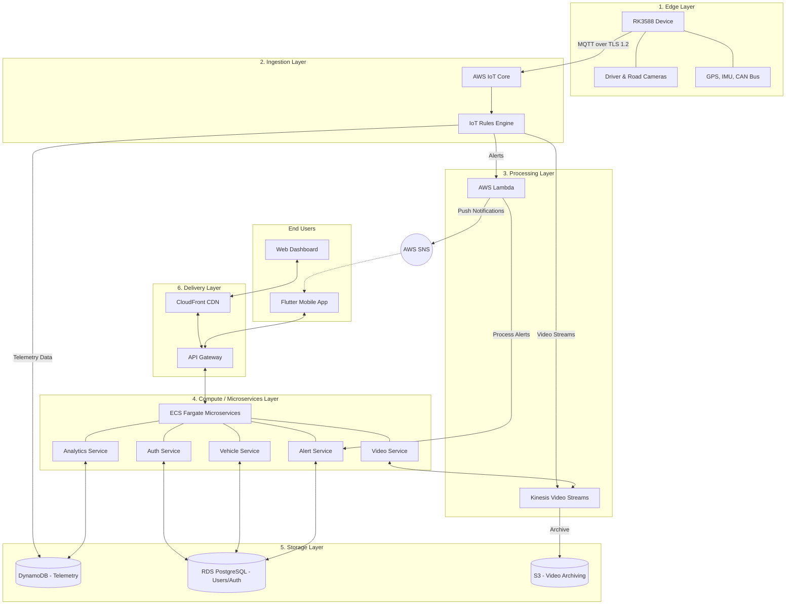
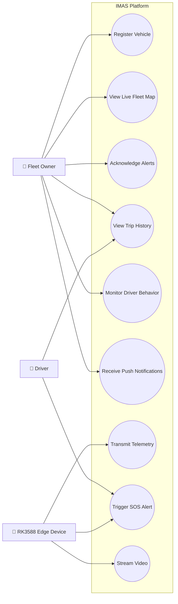
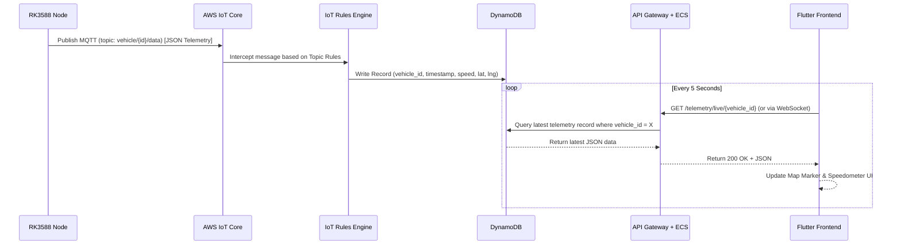
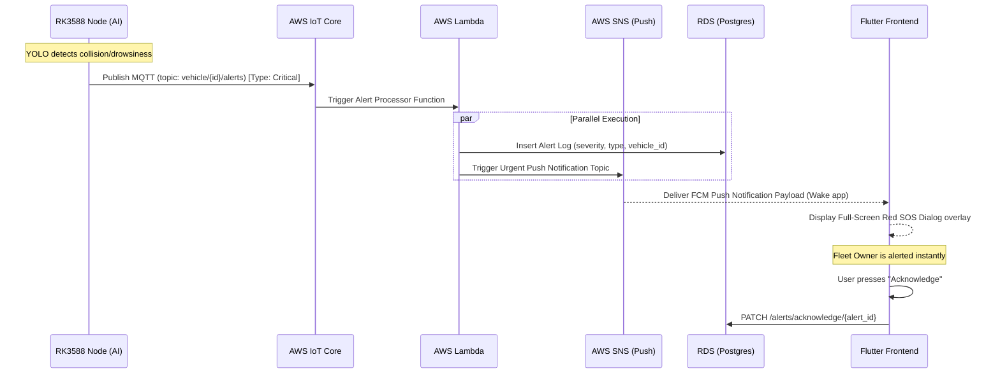
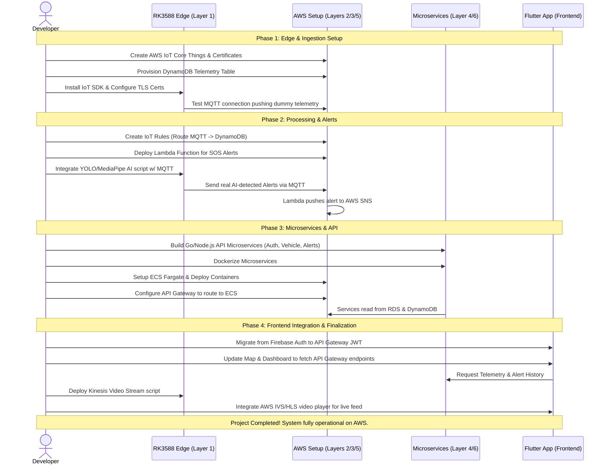

# 📐 IMAS System Architecture Diagrams
This document contains the structural, behavioral, and interaction diagrams for the IMAS (Intelligent Monitoring for Advanced Safety) platform, using your target AWS architecture.

---

## 1. System Architecture Block Diagram (The 6 Layers)
This diagram illustrates the full end-to-end data flow from the edge device (vehicle) through the AWS cloud layers to the end-user applications.



---

## 2. System Use Case Diagram
Shows the primary actors interacting with the IMAS system and the standard operations they perform.



---

## 3. Sequence Diagram: Real-Time Telemetry Flow
This sequence maps exactly what happens when the RK3588 device transmits vehicle speed, fuel, and GPS location.



---

## 4. Sequence Diagram: Critical SOS / Collision Alert Handling
This sequence shows the critical path when an emergency event (like drowsy driver or physical collision) is detected.



---

## 5. Current "As-Is" Data Flow Diagram (Firebase Setup)
Since your app currently relies strictly on Firebase (as analyzed previously), here is how the architecture looks **right now** before the AWS migration.

```mermaid
flowchart TD
    subgraph Mobile Apps
        Flutter[IMAS Flutter App]
    end

    subgraph Google Cloud / Firebase
        Auth[Firebase Auth]
        Store[Cloud Firestore]
        FCM[Firebase Cloud Messaging]
    end

    subgraph Future Hardware Edge
        RK[RK3588 Device\n(Not Connected Yet)]
    end

    %% Login & Registration
    Flutter <-->|1. Email/Google Auth| Auth

    %% Live Subscriptions
    Flutter <-->|2. Stream Vehicles\n(telemetry.speed/lat)| Store
    Flutter <-->|3. Stream safety_alerts| Store

    %% FCM
    Flutter -->|4. Save FCM Token| Store
    FCM -.-x|5. Push Notification\n(No trigger yet)| Flutter

    %% Hardware
    RK -.->|Missing Link:\nNeeds Python script to update Firestore natively| Store

    classDef future stroke-dasharray: 5 5, fill:#222, stroke:#aaa;
    class RK future;
```

---

## 6. Project Implementation Sequence Diagram (Roadmap to Completion)
This sequence diagram shows the step-by-step execution required by the developer and devops team to build, connect, and finalize the blocks from the architecture to complete the project.


